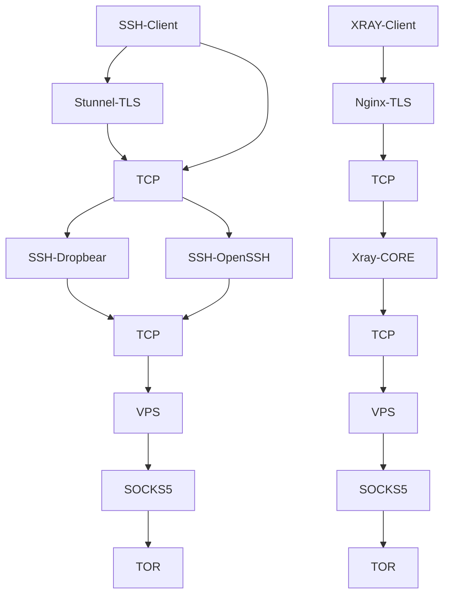

Diagrams Network :

Diagrams Network ASCII :

             ┌─────────────┐
             │   Client    │
             │ (SSH Client)│
             └──────┬──────┘
                    │
                    │ TLS/SSL (Port 777 / ... )
                    │
                    ▼
             ┌─────────────┐
             │  Stunnel    │
             │ (TLS Proxy) │
             └──────┬──────┘
                    │  Forward to internal SSH
                    │  (127.0.0.1:2222 / ... )
                    ▼
             ┌─────────────┐
             │   SSH /     │
             │ Dropbear    │
             └──────┬──────┘
                    │
                    │ (SSH traffic)
                    ▼
             ┌────────────────┐
             │  Tor           │
             │  TransPort     │
             │ 127.0.0.1:9040 │
             └──────┬─────────┘
                    │
                    ▼
             ┌─────────────┐
             │  Internet   │
             │ (via Tor)   │
             └─────────────┘

########################################################################################

             ┌─────────────┐
             │   Client    │
             │   (XRAY     │
             │  over TLS)  │
             └──────┬──────┘
                    │
                    │ TLS/SSL (Port 443 / ... )
                    │
                    ▼
             ┌─────────────┐
             │    Nginx    │
             │ (TLS Proxy) │
             └──────┬──────┘
                    │  Forward to internal Xray
                    │  (127.0.0.1:10001 / 10002 / ... )
                    ▼
             ┌─────────────┐
             │  Xray-CORE  │
             └──────┬──────┘
                    │
                    │ TCP traffic
                    ▼
             ┌────────────────┐
             │   Tor          │
             │  TransPort     │
             │ 127.0.0.1:9040 │
             └──────┬─────────┘
                    │
                    ▼
             ┌─────────────┐
             │  Internet   │
             │ (via Tor)   │
             └─────────────┘
